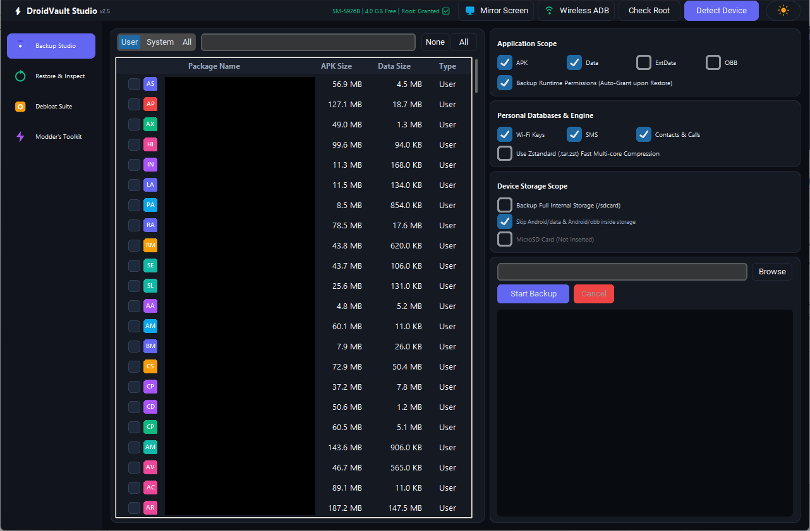

<div align="center">
   
# ⚡ DroidVault Studio

### Universal Android Management Suite

**Backup • Restore • Debloat • Mod — all on your PC, nothing left behind on your phone.**

[](LICENSE)

[](#downloads)
[](https://github.com/alihashemi1313/DroidVault-Studio/releases/latest)
[](#-requirements)


[](https://github.com/alihashemi1313/DroidVault-Studio/actions/workflows/ci.yaml)

<br/>



</div>

---

> [!NOTE]
> **Root is optional:** APK extraction, internal storage transfer, system debloating, screen mirroring, and Wireless ADB operate without root. Root access (Magisk, KernelSU, or APatch) is strictly required only for full application data (`/data/data`), system databases (SMS/Contacts), and the Modder's Toolkit.
---

## 📚 Table of Contents

1. [✨ Features](#-features)
2. [📋 Requirements](#-requirements)
3. [⚙️ Installation & Downloads](#️-installation)
4. [🔑 First-Time Setup — Granting Root Access](#-first-time-setup--granting-root-access)
5. [🚀 Usage Guide](#-usage-guide)
   - [📦 Backup Studio](#-backup-studio)
   - [♻️ Restore Manager](#️-restore-manager)
   - [🧹 Debloat Suite](#-debloat-suite)
   - [🛠️ Modder's Toolkit](#️-modders-toolkit)
   - [📶 Wireless ADB](#-wireless-adb)
   - [🖥️ Screen Mirroring](#️-screen-mirroring)
6. [🛡️ Safety & Architecture](#️-safety--architecture)
7. [⚠️ Cautions & Known Limitations](#️-cautions--known-limitations)
8. [🧯 Troubleshooting](#-troubleshooting)
9. [❓ FAQ](#-faq)
10. [📁 Project Structure](#-project-structure)
11. [📄 License](#-license)

---

## ✨ Features

| Module | What it does |
|---|---|
| 📦 **Backup Studio** | Backs up APKs, app data, external data, OBB, runtime permissions, Wi-Fi passwords, SMS, Contacts/Call logs, and full internal storage — streamed straight to your PC |
| ♻️ **Restore Manager** | Restores any backup session with atomic, all-or-nothing safety and automatic rollback on failure or cancellation |
| 🧹 **Debloat Suite** | Freeze, unfreeze, or uninstall (user 0) bloatware, with a Safety Level rating per package and one-click "select safe bloat" |
| 🛠️ **Modder's Toolkit** | Streams `boot.img` and your root manager's modules folder (Magisk/KernelSU) straight to your PC |
| 📶 **Wireless ADB** | Pair and connect over Wi-Fi — no cable needed once paired |
| 🖥️ **Screen Mirroring** | One click launches [scrcpy](https://github.com/Genymobile/scrcpy) against the connected device |
| 🌗 **Dark / Light Theme** | Toggle instantly, with real per-app icons and sortable columns everywhere |
| 🔍 **Sortable Tables** | Click any column header (Name, Size, Type, Version, Safety Level...) to sort — click again to reverse |

> [!TIP]
> Every column header in every table is clickable. Click **APK Size** twice to find your biggest apps in seconds.

---

## 📋 Requirements

| Requirement | Details |
|---|---|
| 🐍 Python | 3.9 or newer |
| 📦 Python packages | `customtkinter`, `Pillow` (install below) |
| 🔌 ADB | Android Platform Tools, bundled in both Windows and Linux releases |
| 📱 Android device | Non-root for general tasks | Rooted (Magisk / KernelSU) for /data/data backups |
| 🔗 Connection | USB cable (with USB debugging authorized) or Wireless ADB |
| 🖱️ Optional | [scrcpy](https://github.com/Genymobile/scrcpy), for the Mirror Screen button; bundled in both releases |

<details>
<summary>🐧 Linux users — one extra step</summary>

Tkinter isn't always bundled with Python on Linux. If the app fails to start with a Tkinter-related error:

```bash
sudo apt install python3-tk      # Debian/Ubuntu
sudo dnf install python3-tkinter # Fedora
```

</details>

---

## ⚙️ Installation & Downloads

### 🚀 Method 1: Pre-built Binaries (Recommended — No Python needed)

Download the latest standalone package directly from [Releases](https://github.com/alihashemi1313/DroidVault-Studio/releases/latest):

- **Windows 10 / 11:** Download `DroidVault-Studio-v2.5-Windows-x64.zip`, extract it anywhere, and launch `DroidVault-Studio.exe`. (ADB, Scrcpy, and all GUI runtimes are bundled).
- **Linux:** Download `DroidVault-Studio-v2.5-Linux-x64.tar.gz`, extract it, and run `./DroidVault-Studio` (ADB and Scrcpy are bundled).

Release archives include `SHA256SUMS.txt`; verify it with `sha256sum --check SHA256SUMS.txt`
before running an archive. Release builds pin the third-party tool versions and verify their
SHA-256 digests in CI. Windows releases require Authenticode signing; the workflow fails
before packaging if signing is not enabled or the release signing secrets are unavailable.
Linux releases use checksum verification only (no signing key is currently configured by
this workflow).

Maintainers must configure the repository variables `SCRCPY_WINDOWS_SHA256`,
`SCRCPY_LINUX_SHA256`, and `PLATFORM_TOOLS_LINUX_SHA256` with the published
SHA-256 values for the pinned downloads before dispatching a release build.
For Windows Authenticode signing, set `WINDOWS_SIGNING_ENABLED` to `true` and provide the
base64-encoded PFX in `WINDOWS_SIGNING_CERTIFICATE` plus its password in
`WINDOWS_SIGNING_CERTIFICATE_PASSWORD`. The private key must never be committed.

---

### 🛠️ Method 2: Run from Source (Developers)

1. Clone the repository:
   ```bash
   git clone https://github.com/alihashemi1313/DroidVault-Studio.git
   cd DroidVault-Studio
   ```
2. Install dependencies:
   ```bash
   pip install -r requirements.txt
   ```
   Source execution uses `tools/<platform>/` when present and otherwise falls back to
   native `adb`/`scrcpy` commands available on your PATH.
3. Run the application:
   ```bash
   python main.py
   ```

> [!NOTE]
> On first run, a `config.json` (your saved paths/theme) and a `cache/` folder (extracted app icons) are created next to `main.py`. Both are safe to delete at any time — the app rebuilds them automatically.

---

## 🔑 First-Time Setup — Granting Root Access

DroidVault Studio talks to your phone over `adb shell`, then escalates with `su` for anything that touches app data, system partitions, or protected files. Because that `su` request comes from a **non-interactive** ADB shell (not a tap-to-open app), each root manager needs a one-time nudge to allow it.

### On the phone

1. Enable **Developer Options → USB debugging**.
2. Connect the cable (or set up [Wireless ADB](#-wireless-adb)) and tap **Allow** on the "Allow USB debugging?" prompt.

### Magisk

| Step | Action |
|---|---|
| 1 | Open the **Magisk** app → **Superuser** tab |
| 2 | The first time DroidVault Studio requests root, keep your screen **on and unlocked** — Magisk shows a grant/deny popup that times out after a few seconds |
| 3 | Tap **Grant**. Optionally, find **"Shell"** in the Superuser list afterward and pin it to always-allow |

### KernelSU

> [!IMPORTANT]
> KernelSU generally does **not** show an interactive popup for a plain `adb shell` session — there's no foreground app for it to draw the prompt over. If root requests seem to silently do nothing, this is why.

| Step | Action |
|---|---|
| 1 | Open the **KernelSU** manager app |
| 2 | Go to **Superuser** and look for an entry for **Shell** / **ADB** (it may only appear after DroidVault Studio has attempted a root command once) |
| 3 | Manually grant it root access from the list |
| 4 | Re-run **Check Root** in the app header |

Once granted, click **🔍 Detect Device → Check Root** in the header. A green **"Root: Granted"** badge confirms you're ready.

---

## 🚀 Usage Guide

### 📦 Backup Studio

**Quick start — your first backup:**

1. Click **Detect Device** in the header. Wait for the green root badge.
2. Use the **User / System / All** filter and the search box to find the apps you want.
3. Click each app row to check it (or use **All** / **None**).
4. In the right-hand panel, pick your scope:

| Section | Options |
|---|---|
| **Application Scope** | `APK` · `Data` · `ExtData` · `OBB` · Backup Runtime Permissions |
| **Personal Databases & Engine** | `Wi-Fi Keys` · `SMS` · `Contacts & Calls` · Use Zstandard compression |
| **Device Storage Scope** | Backup Full Internal Storage (`/sdcard`) · Skip `Android/data` & `Android/obb` duplicates · MicroSD card (if inserted) |

5. Pick (or type) a **destination folder** on your PC.
6. Click **Start Backup**. Progress and a live log appear below.

> [!TIP]
> Leave **"Skip Android/data & Android/obb inside storage"** checked when you're also backing up app data separately — otherwise you'll back up the same files twice.

> [!CAUTION]
> A full internal-storage backup copies **everything** on `/sdcard` — photos, videos, downloads. Make sure your PC has enough free space before enabling it.

---

### ♻️ Restore Manager

1. Browse to the folder where your backups live and click **Scan**.
2. Pick a session from the dropdown — the app list on the left populates automatically.
3. Check the apps you want restored (or **All**).
4. Choose your scope (mirrors the Backup Studio options) — `APK`, `Data`, `ExtData`, `OBB`, permission auto-grant, Wi-Fi/SMS/Contacts, and internal/SD storage **if that session includes them** (the checkboxes enable themselves automatically).
5. Click **Start Restore**.

> [!NOTE]
> **Restoring to a phone with the app not installed at all works fine** — as long as **APK** stays checked, DroidVault Studio installs the app first and restores its data on top. If you uncheck APK and the app isn't already installed, it safely refuses (there'd be nothing to own the restored data).

> [!TIP]
> Restoring a backup made on a different Android version (e.g. after an OS upgrade) is safe: SMS/Contacts restoration checks the database schema first and skips itself rather than risk corrupting a system provider, and app data restoration doesn't depend on Android version at all. Wi-Fi restore is attempted with a compatibility notice logged. See the [FAQ](#-faq) for details.

---

### 🧹 Debloat Suite

| Button | Effect | Reversible? |
|---|---|---|
| ✅ **Select Safe Bloat** | Auto-checks everything rated `Safe` in the known-bloatware list | — |
| ❄️ **Freeze** | Disables the package for the current user (`pm disable-user`) | ✅ Yes — Unfreeze |
| 🔥 **Unfreeze** | Re-enables a frozen package | — |
| 🗑️ **Uninstall (User 0)** | Removes the app for your user profile (`pm uninstall -k --user 0`), keeping its data so a system app can be reinstalled later via **`cmd package install-existing`** | ⚠️ Usually, not guaranteed |

Safety Level column (click to sort by risk):

| Level | Meaning |
|---|---|
| 🟢 **Safe** | Well-known to be safely removable/frozen for most users |
| 🟡 **Recommended** | Generally fine to remove, slightly more app-specific |
| 🟠 **Caution** | Unrated package (shown for unknown system apps) — research before touching |
| 🔴 **Advanced** | Removing it can affect core phone features — know what you're doing |

> [!CAUTION]
> Uninstalling or freezing the **wrong system package** can break core phone functions (calling, notifications, even booting). Never touch anything you don't recognize just because it's "System" — when in doubt, use **Freeze** (reversible) instead of **Uninstall**, and stick to packages you've actually looked up.

---

### 🛠️ Modder's Toolkit

| Tool | What it does |
|---|---|
| **Dump boot.img to PC** | Streams the live boot partition straight to a file on your PC — nothing is ever written to phone storage |
| **Backup Modules Archive** | Archives your entire `/data/adb/modules` folder (all active Magisk/KernelSU modules) to your PC |

> [!TIP]
> Dump `boot.img` **before** flashing a new ROM, kernel, or Magisk/KernelSU patch. If anything goes wrong, you have a known-good boot image to flash back.

---

### 📶 Wireless ADB

1. On the phone: **Developer Options → Wireless debugging** → **Pair device with pairing code**.
2. In DroidVault Studio, click **Wireless ADB** in the header.
3. **Step 1 — Pair:** enter the `IP:Port` and pairing **code** shown on your phone, click **Pair**.
4. **Step 2 — Connect:** enter the device's `IP:Port` shown on the main Wireless debugging screen (a different port than pairing), click **Connect**.

You can now disconnect the USB cable entirely.

---

### 🖥️ Screen Mirroring

Click **Mirror Screen** in the header. If [scrcpy](https://github.com/Genymobile/scrcpy) isn't found automatically, you'll be prompted to browse to `scrcpy.exe` once — the path is remembered after that.

---

## 🛡️ Safety & Architecture

DroidVault Studio isn't a thin wrapper around `adb backup` — it's built around a few core guarantees:

- **🚫 Zero phone-side footprint.** Backups stream directly off the device (`tar` piped over `adb exec-out`) and restores stream directly onto it — no giant temp file is ever parked in phone storage. A safety-checked fallback path exists only for edge cases where streaming isn't supported by your root manager.
- **⚛️ Atomic, all-or-nothing restores.** Every file is staged first, verified, then committed with an atomic move. If a restore is cancelled or crashes partway through, the app rolls the affected app back to its exact previous state.
- **🔁 Automatic crash recovery.** If DroidVault Studio (or your phone) is force-closed mid-restore, the very next time you click **Detect Device**, any incomplete transaction is automatically detected and rolled back — you won't be left with a half-restored app.
- **✅ Checksum-verified archives.** Every backed-up file gets a SHA-256 checksum; restore refuses to use a file that doesn't match, rather than risk writing corrupted data.
- **🗄️ Schema-aware system restores.** SMS and Contacts databases are only restored if their internal schema matches what the current Android version expects — otherwise that component is safely skipped and logged, never force-written.
- **🔒 One operation at a time.** Backup, restore, and debloat actions share a single lock — you can't accidentally start two conflicting operations, and **Cancel** cleanly interrupts and rolls back the in-flight ADB process.
- **📏 Free-space checks.** The app checks both phone and PC free space before large writes, refusing rather than risking a full-disk failure mid-operation.

---

## ⚠️ Cautions & Known Limitations

> [!CAUTION]
> **Keystore-backed app data doesn't survive a restore.** Apps that encrypt their local data with a hardware-backed key (banking apps, Signal, WhatsApp, Authenticator apps, etc.) store that key in the device's secure hardware — it cannot be backed up or transferred. These apps may ask you to log in again or report "corrupted data" after restore. This is a limitation of Android itself, not this tool — it affects every root-based backup tool, including Titanium Backup and Neo Backup.

> [!WARNING]
> **Wi-Fi restore across a big Android version jump** (e.g. restoring a backup from Android 15 onto Android 16) is attempted and usually works, since Android maintains backward migration for this exact OTA-upgrade scenario — but the tool only validates that the file is well-formed XML, not that its internal schema is 100% identical. If saved networks don't reappear after such a restore, just re-add Wi-Fi manually.

> [!WARNING]
> **`boot.img` dumping and flashing is advanced territory.** Dumping is safe and read-only, but whatever you do with the dumped image afterward (patching, flashing) carries the normal risks of any bootloader-level modification. Keep a known-good copy before you experiment.

> [!NOTE]
> Same-app-version restores are the most reliable. Restoring an app's data from a much older or newer version of *that same app* can occasionally fail if the app changed its own internal database format — this is independent of your Android version.

---

## 🧯 Troubleshooting

| Symptom | Likely Cause | Fix |
|---|---|---|
| `ADB not found` on Detect Device | `adb` isn't on your `PATH` | Add platform-tools to `PATH`, or set the `ADB_PATH` environment variable to the full `adb` path |
| Device list is empty | USB debugging not authorized, or cable/driver issue | Reconnect the cable, tap **Allow** on the phone's popup; on Windows, install the OEM USB driver |
| `Root: None` badge, backups fail | Root not granted to the ADB shell session | See [First-Time Setup](#-first-time-setup--granting-root-access) — Magisk and KernelSU each need a manual grant |
| Root request seems to do nothing (KernelSU) | No interactive prompt exists for non-interactive `adb shell` | Grant **Shell**/**ADB** manually inside the KernelSU manager app, then **Check Root** again |
| Real app icons don't show, only initials | Icon not extracted yet, or app has an unusual icon format | Icons load lazily in the background — give it a moment; a colored monogram is always the safe fallback |
| Theme switch or sorting feels off | You're on an older build | Update to the latest `main.py` — icon caching and column sorting were both hardened |
| "Busy" warning when starting an action | Another operation is still running | Wait for it to finish, or click **Cancel** on the running one first |
| Mirror Screen does nothing | scrcpy not installed/found | Install [scrcpy](https://github.com/Genymobile/scrcpy), or browse to `scrcpy.exe` when prompted |
| Wireless pairing fails | Wrong pairing vs. connect port | The **pairing code screen** and the **main Wireless debugging screen** show *different* IP:Port pairs — use each in its matching step |

---

## ❓ FAQ

**Does restoring work on a freshly flashed ROM where the app was never installed?**
Yes — with **APK** checked (the default), the app is installed first and its data is restored on top, regardless of whether it previously existed on this device.

**Can I restore a backup from Android 15 onto a phone now running Android 16?**
Yes, it isn't blocked. App data restoration has no OS-version dependency at all. SMS/Contacts are protected by a real schema check (they'll skip themselves rather than risk corruption if incompatible). Wi-Fi is attempted with a compatibility notice — see [Cautions](#️-cautions--known-limitations).

**Where are my backups stored?**
Wherever you pick as the destination folder — entirely on your PC, organized into timestamped session folders. Nothing is left on the phone.

**Can I move a backup folder to a different PC or drive?**
Yes, a session folder is fully self-contained — just point **Restore Manager** at its parent folder and click **Scan**.

**Does this modify my system partitions by default?**
No. Every action is opt-in via checkboxes/buttons. The only partition-level operation is the optional `boot.img` dump in the Modder's Toolkit, and dumping is read-only.

**What if I cancel or my phone disconnects mid-restore?**
The affected app is automatically rolled back to its prior state — either immediately, or on the next time you click **Detect Device** if the app itself was closed first.

---

## 📁 Project Structure

```
📂 DroidVaultStudio/
├── main.py              🖼️  GUI — all four Studios, theming, tables
├── adb_utils.py         🔌  ADB wrapper — streaming, validation, icon extraction
├── backup_manager.py    📦  Backup orchestration
├── restore_manager.py   ♻️  Restore orchestration — transactions & rollback
├── config.json           ⚙️  Auto-created — your saved paths & theme
└── cache/
    └── icons/            🖼️  Auto-created — extracted real app icons
```

---

## 📄 License

This project is released under the **GNU General Public License v3.0**. Please consult the [LICENSE](LICENSE) file for details and the full text of the license.
---

<div align="center">

Made for people who don't trust their bloatware, their bootloader, or their next OTA update. 🛡️

</div>
